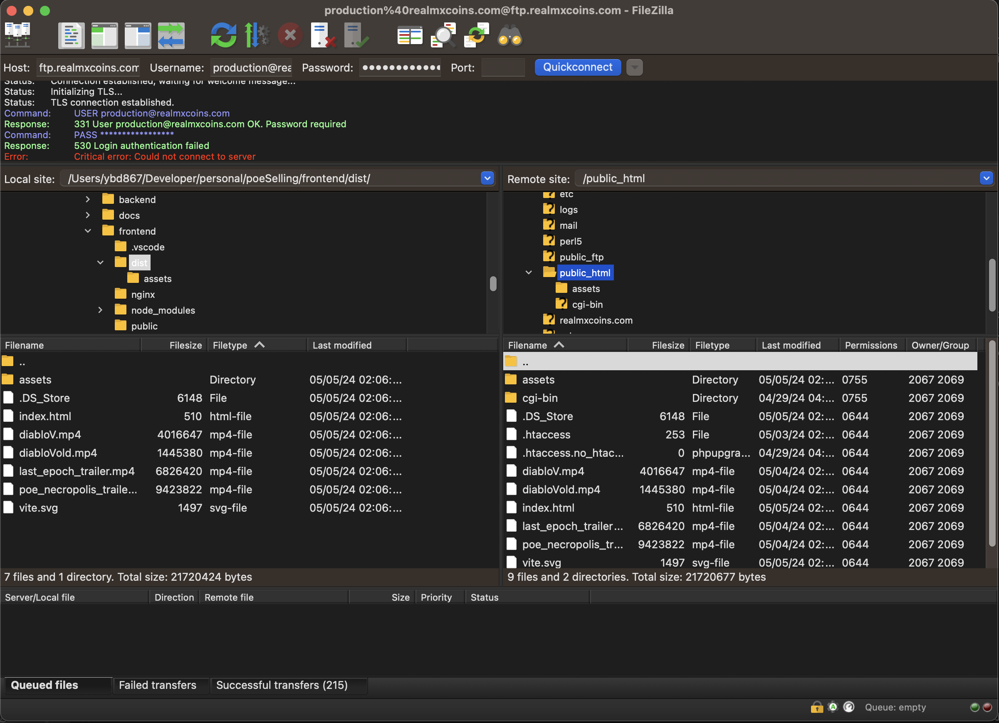

# Poe Selling - Frontend

## Deploy

### 1. Build do projeto

Pré requisitos:
- NodeJS v21

O nosso servidor está hospedado no Hostgator, com plano compartilhado, impossibilitando de realizarmos deploy diretamente no servidor.

Para realizar o deploy, basta seguir os seguintes passos:

1. Baixa o código mais recente do projeto, através do comando `git pull origin main`
2. Instale as dependências com `npm install`
3. Roda o comando `npm run build`

Após o build ser executado, será criada uma pasta `dist`, que deverá ser copiada para a pasta do servidor.

### 2. Copia a pasta `dist` para o servidor

Antes de copiar os arquivos, primeiro é necessário conectar ao servidor FTP. Para isso você pode utilizar a ferramenta que quiser, até mesmo o terminal.
Para este exemplo, vamos utilizar o _FileZilla_.

Para conectar ao servidor você vai utilizar os seguintes parâmetros:
```yaml
host: ftp.realmxcoins.com
username: production@realmxcoins.com
password: @Ridersonthestorm
```

Depois de estabelecer a conexão, basta copiar a pasta `dist` para o servidor diretamente na pasta public_html conforme mostra a figura abaixo:


Obs.: Se não houver atualização nos vídeos, pode enviar apenas o arquivo `index.html` para o servidor. Que será executado mais rapidamente.